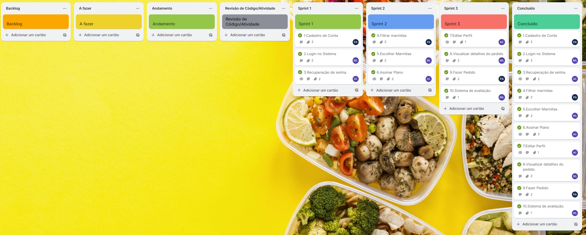
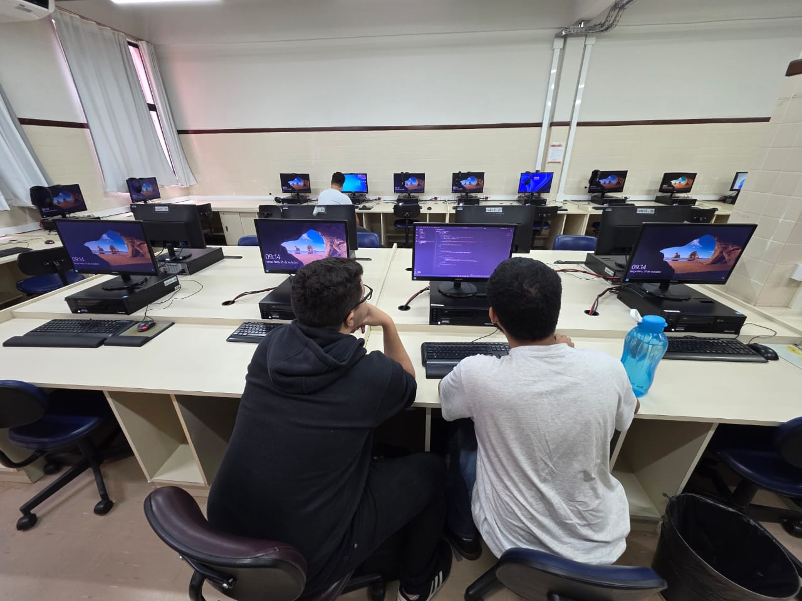

# Marmitex
## 🥗 Sistema de Marmitas Sustentáveis  

## 🎯 Objetivo

O nosso projeto está sendo desenvolvido com o intuito de auxiliar pessoas que não dispõem de tempo para preparar refeições saudáveis no dia a dia. A aplicação web responsiva permitirá que os usuários realizem cadastro, escolham opções de marmitas balanceadas e efetuem pedidos de forma prática, tanto pelo computador quanto pelo celular. Além disso, a plataforma visa promover a adoção de hábitos alimentares mais saudáveis, oferecendo uma solução acessível, conveniente e integrada ao cotidiano dos usuários.

---

## 👥 Equipe
- **Miguel Loureiro**
- **Arthur Francisco** 
- **Pedro Avellar** 
---

## 📌 Funcionalidades 
1. Cadastro/Login de Usuário (cliente e admin)  
2. Gestão de Marmitas (admin cadastra, clientes visualizam)  
3. Pedidos (seleção de marmitas, acompanhamento de status)  

---
⚙️ **Ferramentas tecnológicas**  
Para o desenvolvimento desse projeto utilizamos:

- [Figma](https://www.figma.com/design/teISHJKOZdnJXc4PcsHMz0/Marmitex?node-id=3-5&t=pribS653T5Ew2jtC-0): utilizado para prototipação.
- [Trello](https://trello.com/invite/b/68b609f840b24b48824d8958/ATTI7d213796891627f40f024f6adac0715a59762156/marmitex): utilizado para gestão do projeto;

📎**Print do Trello**  

---

## 🚀 Stack Tecnológica (Aplicação Web – alternativa)

📌 Tecnologias Utilizadas

Linguagem/Framework (Front-end e Back-end): HTML + CSS, JavaScript e Node.js com Express

Banco de Dados Local: MySQL

---

## 👨‍💻 Experiência programando em dupla

Durante o desenvolvimento das telas de login, cadastro e recuperação de senha, identificamos alguns problemas de navegação: determinados botões não estavam redirecionando corretamente para as telas desejadas, o que comprometia a usabilidade do aplicativo.

Para resolver essas inconsistências, optamos por trabalhar em programação em par (pair programming), revisando o código juntos e realizando os ajustes em tempo real. Essa prática colaborativa facilitou a detecção dos erros e permitiu uma correção mais rápida e precisa, além de promover a troca de conhecimentos e o alinhamento de boas práticas entre os membros da equipe.

O resultado foi uma navegação mais fluida e funcional, com todas as rotas corrigidas e o fluxo de autenticação do aplicativo completamente operacional.
---

## 👨‍💻 Experiência programando em dupla 2.0

Durante a Sprint 3, avançamos no desenvolvimento das funcionalidades essenciais da plataforma, implementando quatro user stories principais. Começamos pela edição de perfil, onde estruturamos a tela e o fluxo que permitem ao usuário atualizar suas informações pessoais de forma simples e segura, garantindo sincronização correta com o banco de dados. Em seguida, desenvolvemos a visualização dos detalhes do pedido, criando uma interface que exibe todas as informações relevantes da compra, como itens selecionados, valores e status, proporcionando maior transparência ao usuário.

Também implementamos o processo de fazer pedido, integrando a seleção de produtos ao backend e garantindo que todo o fluxo  da escolha à confirmação  funcionasse de forma estável e intuitiva. Por fim, finalizamos o sistema de avaliação, permitindo que o usuário deixe feedback sobre suas experiências, contribuindo para a melhoria contínua do serviço.

Essas entregas consolidaram a estrutura central do sistema, tornando a navegação mais completa e aproximando o projeto do funcionamento final desejado.
---
## Demonstração do projeto
- [Screencast](https://drive.google.com/file/d/17c92FilwFrDSenm4oUsdi9c3FezPRARy/view?usp=sharing)📺 
---
🪟Diagrama de atividades do sistema

[Diagrama de atividades](https://www.canva.com/design/DAGzXAC2rGU/8jsmHRh0VAPmJsPWY6Jegw/view?utm_content=DAGzXAC2rGU&utm_campaign=designshare&utm_medium=link2&utm_source=uniquelinks&utlId=ha495ff7f22#1)

---
## ⚙️**Bug tracker final** 

