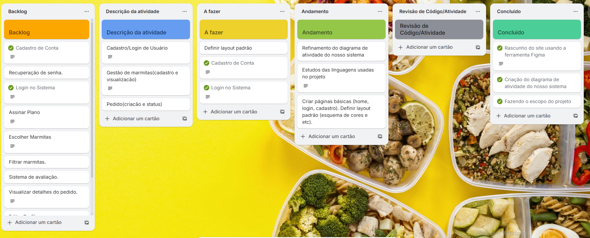

# Marmitex
## 🥗 Sistema de Marmitas Sustentáveis  

## 🎯 Objetivo

O nosso projeto está sendo desenvolvido com o intuito de auxiliar pessoas que não dispõem de tempo para preparar refeições saudáveis no dia a dia. A aplicação web responsiva permitirá que os usuários realizem cadastro, escolham opções de marmitas balanceadas e efetuem pedidos de forma prática, tanto pelo computador quanto pelo celular. Além disso, a plataforma visa promover a adoção de hábitos alimentares mais saudáveis, oferecendo uma solução acessível, conveniente e integrada ao cotidiano dos usuários.

---

## 👥 Equipe
- **Miguel Loureiro**
- **Arthur Francisco** 
- **Pedro Avellar** 
---

## 📌 Funcionalidades 
1. Cadastro/Login de Usuário (cliente e admin)  
2. Gestão de Marmitas (admin cadastra, clientes visualizam)  
3. Pedidos (seleção de marmitas, acompanhamento de status)  

---
⚙️ **Ferramentas tecnológicas**  
Para o desenvolvimento desse projeto utilizamos:

- [Figma](https://www.figma.com/design/teISHJKOZdnJXc4PcsHMz0/Marmitex?node-id=3-5&t=pribS653T5Ew2jtC-0): utilizado para prototipação.
- [Trello](https://trello.com/invite/b/68b609f840b24b48824d8958/ATTI7d213796891627f40f024f6adac0715a59762156/marmitex): utilizado para gestão do projeto;

📎**Print do Trello**  

---

## 🚀 Stack Tecnológica (Aplicação Web – alternativa)

📌 Tecnologias Utilizadas

Linguagem/Framework (Front-end e Back-end): HTML + CSS, JavaScript e Node.js com Express

Banco de Dados Local: MySQL

---

## Demonstração do projeto
- [Demo do projeto](https://drive.google.com/file/d/1f9CWffTIcbGH0WevOli8SQ4z2urSqER6/view?usp=sharing) Com as 3 primeiras histórias de usuarios implementada:.
---
🪟Diagrama de atividades do sistema

[Diagrama de atividades](https://www.canva.com/design/DAGzXAC2rGU/Z5S40FJHBrG6fbi9pfS5Mg/edit?utm_content=DAGzXAC2rGU&utm_campaign=designshare&utm_medium=link2&utm_source=sharebutton)

---

## 📊 Priorização das Entregas
- **Alta**  
  - Cadastro
  - Login de Usuário  
  - Filtrar marmitas
  - Escolher Marmitas
  - Fazer Pedido
  - Visualizar Detalhes do Pedido após Finalização

- **Média**  
  - Alterar Senha  
  - Editar Perfil

- **Baixa**  
  - Planos de Assinatura  
  - Sistema de avaliação
---
