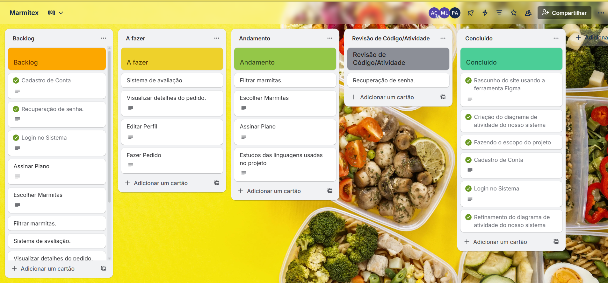
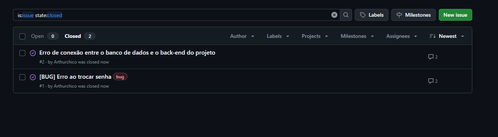

# Marmitex
## 🥗 Sistema de Marmitas Sustentáveis  

## 🎯 Objetivo

O nosso projeto está sendo desenvolvido com o intuito de auxiliar pessoas que não dispõem de tempo para preparar refeições saudáveis no dia a dia. A aplicação web responsiva permitirá que os usuários realizem cadastro, escolham opções de marmitas balanceadas e efetuem pedidos de forma prática, tanto pelo computador quanto pelo celular. Além disso, a plataforma visa promover a adoção de hábitos alimentares mais saudáveis, oferecendo uma solução acessível, conveniente e integrada ao cotidiano dos usuários.

---

## 👥 Equipe
- **Miguel Loureiro**
- **Arthur Francisco** 
- **Pedro Avellar** 
---

## 📌 Funcionalidades 
1. Cadastro/Login de Usuário (cliente e admin)  
2. Gestão de Marmitas (admin cadastra, clientes visualizam)  
3. Pedidos (seleção de marmitas, acompanhamento de status)  

---
⚙️ **Ferramentas tecnológicas**  
Para o desenvolvimento desse projeto utilizamos:

- [Figma](https://www.figma.com/design/teISHJKOZdnJXc4PcsHMz0/Marmitex?node-id=3-5&t=pribS653T5Ew2jtC-0): utilizado para prototipação.
- [Trello](https://trello.com/invite/b/68b609f840b24b48824d8958/ATTI7d213796891627f40f024f6adac0715a59762156/marmitex): utilizado para gestão do projeto;

📎**Print do Trello**  

---

## 🚀 Stack Tecnológica (Aplicação Web – alternativa)

📌 Tecnologias Utilizadas

Linguagem/Framework (Front-end e Back-end): HTML + CSS, JavaScript e Node.js com Express

Banco de Dados Local: MySQL

---

## 👨‍💻 Experiência programando em dupla

Durante o desenvolvimento das telas de login, cadastro e recuperação de senha, identificamos alguns problemas de navegação: determinados botões não estavam redirecionando corretamente para as telas desejadas, o que comprometia a usabilidade do aplicativo.

Para resolver essas inconsistências, optamos por trabalhar em programação em par (pair programming), revisando o código juntos e realizando os ajustes em tempo real. Essa prática colaborativa facilitou a detecção dos erros e permitiu uma correção mais rápida e precisa, além de promover a troca de conhecimentos e o alinhamento de boas práticas entre os membros da equipe.

O resultado foi uma navegação mais fluida e funcional, com todas as rotas corrigidas e o fluxo de autenticação do aplicativo completamente operacional.
---

## 👨‍💻 Experiência programando em dupla 2.0

Durante a implementação da tela de Cardápio, identificamos diversos problemas relacionados ao carregamento e à exibição das informações provenientes do banco de dados. Em alguns casos, as consultas não retornavam os dados esperados; em outros, o formato recebido não era compatível com o modelo utilizado na interface, o que resultava em falhas na renderização do cardápio.

Essas inconsistências afetavam diretamente a usabilidade, já que o aplicativo não conseguia exibir corretamente os itens disponíveis, prejudicando a experiência do usuário.

Para solucionar esses problemas, adotamos a prática de programação em par (pair programming). Trabalhando em dupla, analisamos as queries, revisamos a lógica de comunicação com o banco e sincronizamos o fluxo de dados entre o backend e a interface. Essa abordagem colaborativa tornou o processo de depuração mais eficaz e possibilitou uma correção mais rápida, precisa e alinhada entre os membros da equipe.

Como resultado, a tela de Cardápio passou a funcionar de forma estável, apresentando todas as informações corretamente atualizadas e refletindo fielmente os dados do banco. O fluxo de navegação também se tornou mais consistente, proporcionando uma experiência mais fluida ao usuário.
---
## Demonstração do projeto
- [Demo do projeto](https://drive.google.com/file/d/1f9CWffTIcbGH0WevOli8SQ4z2urSqER6/view?usp=sharing) Com as 3 primeiras histórias de usuarios implementada:.
---
🪟Diagrama de atividades do sistema

[Diagrama de atividades](https://www.canva.com/design/DAGzXAC2rGU/8jsmHRh0VAPmJsPWY6Jegw/view?utm_content=DAGzXAC2rGU&utm_campaign=designshare&utm_medium=link2&utm_source=uniquelinks&utlId=ha495ff7f22#1)

---
## ⚙️**Bug tracker** 

